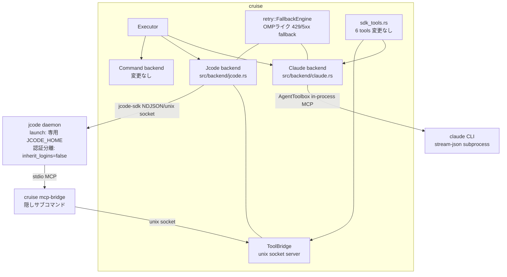

# JCODE.md — seher 完全削除 / jcode + ClaudeSDK 移行計画

対象リポジトリ: `smartcrabai/cruise`
調査日: 2026-08-28
調査対象: cruise HEAD / seher 0.0.59 (`../seher`) / jcode v0.81.1 (commit `a5f17d2`) / omp docs

禁止事項は [PROHIBITED.md](PROHIBITED.md) を参照。本計画のすべての作業はそれに従う。

---

## 1. ゴール

1. `seher-sdk` (crates.io `seher-sdk = "0.0.59"`) への依存を **完全に削除** する。
2. プロンプト実行の SDK バックエンドを次の 2 つだけにする:
   - **`sdk: jcode`** — [1jehuang/jcode](https://github.com/1jehuang/jcode) を駆動（新規・**既定**: `sdk`/`command` 両未指定 — 現在は "either `command` or `sdk` must be specified" の validation error になる組合せ — を `jcode` の既定として valid 化する。additive であり、既存の valid な設定の挙動は不変）
   - **`sdk: claude`** — ClaudeSDK（crates.io `seher-claude-agent-sdk = "=0.0.59"` に依存し、repo 内コピーを `[patch.crates-io]` で使用、§3.3）で `claude` CLI を in-process 駆動
3. jcode SDK は custom tools 非対応のため、**stdio MCP ブリッジ**で cruise のツール群を露出する。
4. **OMP ライクな 429/5xx 自動モデルフォールバック** を cruise 側に実装する（jcode のクロスプロバイダ failover は TUI 限定で headless/SDK 経路では動かないため）。
5. 既存の `command:` バックエンド（外部 CLI、例 `claude -p`）は **無変更で維持**（seher 非依存のため削除対象外）。
6. cruise が使う認証情報はユーザの jcode(TUI) 用 (`~/.jcode`) と**ファイル分離**する（§3.5）。投入 UI として `cruise login` サブコマンドを新設する。
7. **crates.io publish（`cargo install cruise`、0.1.86 が公開中）を壊さない**: path 依存の workspace member を増やさない。vendor は `[patch.crates-io]` 方式（`vendor/asupersync` の既存前例）に限る。

---

## 2. 現状アーキテクチャ（調査結果）

### 2.1 バックエンド 3 系統

呼び出し元（`src/engine.rs:1066`, `src/planning.rs:183`, `src/plan_cmd.rs:508`, `src/worktree_pr.rs:195`）はすべて
`Executor::new(config.sdk, config.command)` + `PromptRun{..} -> PromptOutcome` の単一 I/F しか見ない。
`src-tauri/src/commands.rs` は Executor を直接呼ばず、`cruise::planning` API（`read_sdk_transcript`（commands.rs:1285、内部が `pi_session_path` 依存）・`sdk_plan_tools_enabled`（commands.rs:1102））経由でのみ SDK 層に依存する。

| backend | 選択 | 実装 | rate-limit 挙動 |
|---|---|---|---|
| Command | `command: [...]` | `run_command` → `step/prompt.rs run_prompt` | `is_rate_limited(stderr)` + `calculate_backoff` (2s 倍々, 60s cap) |
| Sdk (`sdk: seher`) | seher の `~/.config/seher/config.yaml` で provider 解決 | `run_sdk` → `poll_for_agent`(60s poll) → `spawn_agent_stream` が `resolved.sdk` で 6 実装 (pi/omp/pi-rust/claude/claude-terminal/claude-headless) に二段 dispatch | 別 provider へ再解決してリトライ |
| Pi (`sdk: pi`) | `pi_agent_rust` in-process | `run_pi_direct` → `PiRunner::stream` | 同一 model に指数バックオフ、fresh session |

### 2.2 seher へのコンパイル依存（全 3 ファイル）

| ファイル | 依存内容 |
|---|---|
| `src/executor.rs` | 実質全部。`seher::sdk::{CodexBarProbe, EffortLevel, PiRunner, PiRunnerOptions, PollOptions, SeherTool, StreamChunk, poll_for_agent, split_thinking_suffix}` + パス修飾で `ResolvedAgent`, `CancelToken`, `RunAgentOptions`, `stream_for_resolved`, `pi_session_path`, `close_omp_session`, `close_pi_session`, `split_model_ref`、`seher::claude_agent::{ClaudeAgentRunnerConfig, stream_agent}`、`seher::claude_headless::*`、`seher::claude_terminal::*` |
| `src/sdk_tools.rs` | 型のみ: `seher::sdk::{SeherTool, ToolHandler}` |
| `src/planning.rs:466` | `seher::sdk::pi_session_path`（plan 未生成時の transcript 診断 1 箇所） |

### 2.3 移行で保つべき最小契約（4 点）

1. **Tools**: name + description + JSON schema + 同期 handler `Arc<dyn Fn(serde_json::Value) -> Result<String, String> + Send + Sync>`。
   cruise のツールは 6 個（`src/sdk_tools.rs`）: `ask_user` / `submit_plan` / `update_plan` / `generate_title` / `submit_pr_metadata` / `skip_step`。
   handler はワーカースレッドから同期呼び出しされ block してよい（`src/ask_handler.rs:8-12` の前提）。
2. **Stream**: `std::sync::mpsc::Receiver<StreamChunk>` 相当。variant 集合 `Delta(String) / Done(String) / Session(String) / Limit(..) / Error(String)` を `ChunkReducer` が `ChunkOutcome{Done, Limited, Failed, Closed}` に畳み込む。
3. **Session**: session id の発行と resume（planning の plan/fix/ask ターン間で引き継ぎ）。
4. **Model/effort**: `provider/model[:thinking]` 形式の解析と effort 5 段 (`low|medium|high|xhigh|max`)。

### 2.4 seher 側から借りるもの / 捨てるもの

- **依存する**: `seher-claude-agent-sdk = "=0.0.59"`（crates.io に公開済み・存在確認済み。lib 名 `claude_agent_sdk` なので import は `claude_agent_sdk::`）。
  seher に一切依存しない独立 crate。依存は `async-trait / futures / serde / serde_json / thiserror / tokio` のみ。
  in-process MCP tools（`AgentToolbox` + `control_request` JSON-RPC dispatch）、`--resume`、stream-json streaming、`--model` / `--effort` を実装済み。
  上流削除（yank）に備え published .crate を `vendor/claude-agent-sdk/` へ展開し `[patch.crates-io]` で参照する（§3.3、ゴール 7）。
- **cruise 側で再実装する**（seher glue、`seher-sdk/src/claude_agent/mod.rs` 相当）:
  - `ClaudeAgentOptions` 構築 + `Message` ストリーム → cruise `StreamChunk` 変換
  - stderr 64 行リングバッファ + `is_claude_rate_limit_message` による rate-limit 判定
  - **必須ワークアラウンド**: tools あり → `SubprocessCliTransport::streaming` + `user_message_frame(prompt, "default")` を手書き write → `end_input`。
    （`one_shot` / `--print` だと SDK MCP server の initialize ハンドシェイクが完了せず failed になる）
  - 既定 permission_mode は `BypassPermissions`（現行 seher glue と同一）
- **全廃する**: `PiRunner` / `pi_session_path` / `PI_ENV_MUTEX` / `poll_for_agent` / `CodexBarProbe`(外部 `codexbar` バイナリ) / `ResolvedAgent` / mode_key 解決 / `~/.config/seher/config.yaml` / omp・pi RPC runner / claude-terminal / claude-headless。

### 2.5 jcode の制約（ソース確認済み）

- **custom tools 非対応**: harness API (`crates/jcode-harness-api/src/requests.rs`) にツール登録 request が存在しない。ACP の `mcpServers` も中身無視。→ 代替は **stdio MCP のみ**（http/sse はロード時スキップ）。
- MCP 設定探索（**後勝ちマージ**）: `$JCODE_HOME/mcp.json` → `~/.claude.json` → `~/.claude/mcp.json` → project-local `.jcode/mcp.json` / `.mcp.json` / `.claude/mcp.json` の順に読み、後のソースが同名 server を上書きする = **project-local が最優先、`$JCODE_HOME/mcp.json` は最弱**。対象 repo の MCP 設定が cruise のセッションに load され得る（§7 リスク）。形式は Claude Code 互換 `{"mcpServers": {"<name>": {"command", "args", "env"}}}`。ツール露出名は `mcp__<server>__<tool>`（`-` は `_` に置換）。
- vendor 対象の `jcode-sdk` / `jcode-harness-api` / `jcode-transport` は `publish = false`（crates.io に無い）→ Rust から使うなら **vendor コピー**（cruise には `vendor/asupersync` の前例あり）。
- **クロスプロバイダ failover は rate-limit 起因では自動実行されない**: `MultiProvider::complete_with_failover` は failover prompt を Err 文字列で返すだけで、パースして実行するのは TUI (`jcode-tui`) のみ（例外: provider が未設定等でスキップされた場合の自動切替は存在）。同一プロバイダ別アカウント切替 (`same_provider_account_failover`) だけ自動。リトライ回数も Anthropic/OpenAI runtime は `MAX_RETRIES = 3` ハードコード。→ **モデルフォールバックは cruise 側の責務**。
- 非対話実行: `jcode run [--json|--ndjson] <MESSAGE>`（`--model` / `--provider` / `--resume <id>` / `-C` 併用可）。
- Rust SDK `crates/jcode-sdk`（path 依存: `jcode-harness-api`, `jcode-transport`）: 同期 API、NDJSON over Unix socket、`launch(LaunchOptions{jcode_home, inherit_logins(既定 true), binary, env, ..})` で private daemon を spawn。`create_session` / `run(sid, msg, RunOptions{auto_approve})` / `events()` / `set_model` / `set_reasoning_effort` / `list_sessions` / `attach_session` / `peek_session` / `fork_session`。
- テレメトリ既定 ON (`JCODE_NO_TELEMETRY=1` で無効化)、自動アップデート既定 ON (`--no-update` 必須)。ライセンス MIT。

---

## 3. 移行後アーキテクチャ



### 3.1 Executor

```rust
pub enum Executor {
    Command { command: Vec<String> },
    Jcode,   // sdk: jcode
    Claude,  // sdk: claude
}
```

- `PromptRun` / `PromptOutcome` の形は不変（`tools` の型名のみ `SeherTool` → cruise ローカル型へ）。呼び出し元 4 箇所は無変更。
- `StreamChunk{Delta, Done, Session, Limit, Error}` と `ChunkOutcome` / `ChunkReducer` / `LineBuffer` / `stream_to_outcome` は cruise ローカル定義として存続（seher の定義をそのまま移す）。
- `mode_key` 概念（`build` / `plan`）は **廃止**。`model` / `plan_model` / per-step `model` は両 SDK とも plain な `provider/model[:effort]` 参照（現行 `sdk: pi` と同じ文法）。**provider 部は jcode の provider id をそのまま使う**（jcode が `claude` と呼ぶなら `claude/...`。cruise 独自 alias・正規化は発明しない — PROHIBITED §1。`fallback_chains` のキーも同じ名前空間）。claude backend の model は claude CLI のモデル名。未指定はバックエンド側の既定（jcode: cruise 専用 `JCODE_HOME` の `config.toml` にある `default_model`、claude: CLI 既定）。fresh な cruise 専用 home では jcode の既定解決が効かない可能性があるため（スパイク (4)(5) で確認）、モデル解決不能時は `cruise login` と `model:` / `--model` 指定を案内する明確なエラーを出す。
- `mode_key_for_step` / `mode_key_for_plan` / `resolve_provider` / `poll_for_agent` スレッド / `spawn_agent_stream` の 6 分岐 / `merge_helper_env` / `finish_sdk_session` / `run_pi_direct` / `build_pi_options` / `parse_pi_model_ref` は削除。`split_thinking_suffix` 相当と `EffortLevel` は cruise ローカルに移植。

### 3.2 ツール定義（`src/sdk_tools.rs`）

- `ToolHandler` 型はそのまま（`Arc<dyn Fn(Value) -> Result<String, String> + Send + Sync>` — claude-agent-sdk `tool.rs:32` の `ToolHandler` と**同一型**なので `Arc::clone` で無変換に渡る）。
- `SeherTool` → cruise ローカル `CruiseTool`（name / description / parameters / handler）に改名。claude backend では `AgentTool` へ、jcode backend では ToolBridge へ 1:1 変換。
- 6 ツールの handler 本体・スキーマ・エラー文言は**一切変更しない**。

### 3.3 Claude backend（`src/backend/claude.rs`）

1. 依存追加: `seher-claude-agent-sdk = "=0.0.59"` + `[patch.crates-io] seher-claude-agent-sdk = { path = "vendor/claude-agent-sdk" }`（`vendor/asupersync` と同一パターン。workspace member にはしない）。
   - `vendor/claude-agent-sdk/` には crates.io の published .crate (0.0.59) を展開する（packaged manifest は workspace 継承が解決済みで `license = "Apache-2.0"` を含む — 継承読み替えも再ライセンス問題も発生しない）。出自（crates.io checksum）を vendor 内 README に記録。
   - .crate に LICENSE ファイルが含まれない場合は `../seher/LICENSE`（Apache-2.0）をコピーして同梱。ソース改変ゼロ。
   - publish 時は `[patch]` が strip され crates.io 依存として解決 = `cargo install cruise` は現状どおり（ゴール 7）。ローカル / cargo-dist ビルドは repo 内コピーを使用。上流が yank した場合は repo 内コピーを自名義（例 `cruise-claude-agent-sdk`）で publish して依存を差し替える。
2. glue を新規実装（§2.4 の再実装項目）。`stream_agent(config, prompt) -> mpsc::Receiver<StreamChunk>`：専用 thread + current_thread tokio runtime（現行 seher glue と同じ構造）。
3. session resume: `ClaudeAgentOptions::resume`。planning のターン間引き継ぎは現行どおり `PromptOutcome::session_id` 経由。
4. 認証分離（任意・要検証）: jcode 側と同様に claude CLI の認証もユーザ利用と分けたい場合は、`ClaudeAgentOptions::env` に `CLAUDE_CONFIG_DIR=<cruise 管理ディレクトリ>` を設定して分離できる（claude CLI の環境変数。P2 で実挙動を検証）。既定はユーザの claude CLI 認証を共用。
5. 既知ギャップ: claude-agent-sdk は `interrupt` / `set_model` / hooks / `can_use_tool` 未実装。キャンセルは transport close（`kill_on_drop`）頼み。cruise の `CancellationToken` 発火で receiver ドロップ → transport 閉鎖、で現行同等の挙動になることを確認する。

### 3.4 Jcode backend（`src/backend/jcode.rs`）

**方針: 案 B'（`JCODE_HOME` 分離の subprocess）を P3 冒頭スパイクで検証し、成立なら採用。不成立時のみ案 A（vendor + 自名義 publish）**

| 案 | 内容 | 判定 |
|---|---|---|
| **B'. `jcode run --ndjson` subprocess（`JCODE_HOME` 分離）** | env `JCODE_HOME=<cruise 専用 home>` + `JCODE_NO_TELEMETRY=1` + `--no-update` で `jcode run --ndjson --model/--provider [--resume <id>] -C <dir>` を spawn し、NDJSON イベントを StreamChunk に写像 | **第一候補**。`JCODE_HOME` 上書きで mcp.json・認証・config.toml・セッションが cruise 専用 home に分離される（旧・案 B の却下理由「~/.jcode を汚す・認証分離不可」は `JCODE_HOME` 未上書きを前提にした誤り）。vendor 不要 = crates.io publish を壊さない（ゴール 7）。fallback は fresh session 方針なので `set_model` の利点は不要。**P3 冒頭スパイクの検証項目**: (1) `JCODE_HOME` env が CLI の home（認証/mcp.json/config.toml/セッション）を実際に切り替える (2) `run` の permission auto-approve 相当（config.toml の permission 設定等） (3) `cruise login --api-key` の非対話投入手段 (4) `--status` 相当（認証済み provider / モデル一覧） (5) `--resume` の実挙動 (6) transcript 診断の代替（`$JCODE_HOME` 配下セッションファイル読み等） (7) **固定 mcp.json + env 継承**: `jcode run` の env に置いた `CRUISE_TOOL_SOCKET` が jcode の spawn する MCP server まで継承されるか（§3.6） (8) **並行安全性**: 同一 `JCODE_HOME` での並行 `jcode run`（複数 cruise プロセス: CLI×GUI・複数 repo）が session store / config を壊さないか |
| A. jcode-sdk vendor | `crates/jcode-sdk`（+path 依存 `jcode-harness-api`, `jcode-transport`）を vendor（MIT）。`launch(LaunchOptions{jcode_home: <cruise data dir>/jcode-home, inherit_logins: false, env: {JCODE_NO_TELEMETRY=1}, ..})` | **フォールバック**（B' スパイク不成立時のみ）。型付きイベント・`set_api_key`・`peek_session`・`attach_session` が使える。ただし publish=false crate の path 依存は crates.io publish を壊すため、採用する場合は 3 crate を自名義（`cruise-jcode-*`）で publish + `[patch.crates-io]` にする（ゴール 7）。 |
| C. jcode フォークで in-process | `Registry` に独自 `Arc<dyn Tool>` 注入 | 不採用。82 crates の追随コスト + `Registry` に公開登録 API が無くフォーク改造必須。PROHIBITED（jcode フォーク禁止）。 |

実装（案 B' 前提。案 A 採用時も写像は同一）:
- `jcode_home` は cruise の既存データディレクトリ慣行に従う固定パス（Linux 例: `~/.local/share/cruise/jcode-home`。macOS は既存コードの流儀に合わせる）でセッション永続化 → resume は `--resume <id>`（案 A: `attach_session(id)`）。セッション肥大は jcode の retention 機構があれば設定、なければ初回リリースでは対応しない。
- イベント → StreamChunk 写像: `text_delta → Delta`、turn 完了 → `Done(text)`、セッション確定 → `Session(id)`、429/limit 系エラー → `Limit`、その他 → `Error`。未知イベントは無視してログのみ（jcode の minor bump 耐性）。
- モデル/effort: 実行ごとに `--model` / `--provider` 指定（effort suffix は jcode の reasoning effort 指定へ写像。案 A: `set_model` / `set_reasoning_effort`）。
- 前提バイナリ: ユーザインストール済み `jcode`（PATH または設定でパス指定）。**P3 スパイクで検証した版を最低バージョン（floor）とし、未満は明確なエラーで停止する**（warn で続行しない — NDJSON イベント形の互換を保証できないため）。上限チェックはしない。floor は README に明記。

### 3.5 認証分離と `cruise login`（要件）

cruise が使う認証情報はユーザの jcode(TUI) 用 (`~/.jcode`) と**ファイルを分ける**。

- `launch(inherit_logins: false, jcode_home: <cruise 専用 home>)` により、認証ストア（OAuth / `<provider>.env`）・config.toml・セッションが cruise 専用 `JCODE_HOME` 配下に完全分離される。ユーザの `~/.jcode` は読み書きともに触らない。
- cruise 側 home への認証投入は **`cruise login` サブコマンド**（新設、additive CLI・既存コマンド無変更）に集約する:

  | 形 | 動作 |
  |---|---|
  | `cruise login` | `JCODE_HOME=<cruise 専用 home>` を設定して `jcode login` を exec — jcode 自身の対話 provider ピッカー / OAuth フローがそのまま走り、認証は cruise 側 home に保存される |
  | `cruise login <provider>` | 同上で `jcode login <provider>` に引数透過（例: `cruise login anthropic`） |
  | `cruise login --api-key <provider>` | キーを stdin（エコーなし）または環境変数から受け取り、jcode の保存形式（owner-only な `<provider>.env`）へ投入する（対応: claude-api / openai-api / openrouter / cursor / gemini / jcode）。投入手段は P3 スパイク (3) で確定: jcode CLI に非対話 login があればそれを exec、無ければ案 A の daemon API `set_api_key(provider, key)`。cruise の設定ファイルには保存しない |
  | `cruise login --status` | 認証済み provider / 利用可能モデルを一覧表示。手段は P3 スパイク (4) で確定（jcode CLI のモデル一覧 or 案 A: 一時セッション + `get_runtime_info` / `list_models`（いずれも session-scoped API）） |

  実装は薄いラッパに徹する: provider 一覧・OAuth フロー・保存形式はすべて jcode 側の実装をそのまま使い、cruise は `JCODE_HOME` の切り替えと exec/API 呼び出しのみ行う。
- **カスタム provider（OpenAI 互換エンドポイント等）**: jcode の `[providers.<name>]` プロファイル形式（`config.toml`）を cruise 専用 home の `config.toml` に書くことで追加できる。cruise 独自の provider 記法は発明しない（PROHIBITED §1）。
- claude backend（`sdk: claude`）の認証は claude CLI 自身のもの（既定はユーザと共用、分離する場合は §3.3 の `CLAUDE_CONFIG_DIR`）で、`cruise login` の対象外。
- 未認証で `sdk: jcode` を実行した場合は、`cruise login` を案内する明確なエラーを出す（jcode の生エラーを素通ししない）。
- 副次効果: 同一アカウントを両方に login した場合、プロバイダ側クォータは共有されるが、認証**ファイル**（トークン更新・失効・env 上書き）は互いに影響しない。別アカウント/別キーを使えばクォータも独立する。

### 3.6 ToolBridge — jcode 向け stdio MCP ブリッジ

jcode の MCP server は jcode が spawn する**別プロセス**だが、cruise のツール handler は
in-process 状態（`AskHandler` の stdin/チャネル、`plan_persisted: Arc<AtomicBool>`、title/PR metadata の `Mutex` store）を捕捉している。よってブリッジで親プロセスに転送する:

1. **cruise 本体側**: prompt 実行ごとに Unix socket（`$XDG_RUNTIME_DIR/cruise-tools-<pid>-<nonce>.sock`）を listen し、`tools/list` / `tools/call` を受けて `Vec<CruiseTool>` の handler を同期実行して返す。
2. **隠しサブコマンド `cruise mcp-bridge`**: stdio MCP server（JSON-RPC 2.0: `initialize` / `tools/list` / `tools/call`）として振る舞い、全 tool 呼び出しを socket 経由で親へ転送。socket パスは env `CRUISE_TOOL_SOCKET` から取得（`--socket <path>` は override）。
3. **登録（並行安全が要件）**: `JCODE_HOME` は全 cruise プロセス共有の固定パスのため、mcp.json をターン/プロセスごとに書き換えると並行実行（CLI×GUI・複数 repo）で相互上書きする。第一候補は **mcp.json を固定内容にし、socket パスは env で渡す**:
   ```json
   {"mcpServers": {"cruise": {"command": "<current_exe>", "args": ["mcp-bridge"]}}}
   ```
   `jcode run` の env（案 A: launch env）に `CRUISE_TOOL_SOCKET=<path>` を設定し、MCP server は jcode の子プロセスとして env を継承する（スパイク (7) で実証）。mcp.json の書き直しは `current_exe` パスが変わった場合のみ、tmp+rename の原子的更新 + flock で行う。env 継承が不成立の場合の fallback は「mcp.json の `env` フィールドへターンごと書き込み + flock 排他」とし、無排他の書き換えは禁止（PROHIBITED §6 の精神）。
4. ツール露出名は `mcp__cruise__ask_user` 等になる。claude backend も AgentToolbox（server 名 `cruise`）経由で `mcp__cruise__*` となり現行 seher（server 名 `seher`）と同型なので、プロンプトテンプレートの素名参照（`ask_user` 等）はそのまま機能する（現行実績あり）。
5. `require_tools` による provider 候補絞り込み（`executor.rs`）は `run_sdk` とともに削除（両バックエンドとも常に tool-capable）。`planning.rs` の `sdk_plan_tools_enabled` は sdk 値非依存（`sdk.is_some() && interactive_planning`）で file-based planning と GUI（src-tauri）が依存するため**削除しない**（doc コメントの seher/pi 言及のみ更新）。`skip_step` の opt-in 登録ロジック（`if.no-file-changes` 限定）は provider 候補絞り込みの意味を失うが、露出ツール最小化のため**現行のまま維持**。

### 3.7 OMP ライク自動フォールバック（`src/retry.rs` 新規）

OMP の `retry` 仕様（`omp://settings.md`, `omp://non-compaction-retry-policy.md`）を cruise の両 SDK バックエンドに移植する。

**トリガー分類**（`classify_retryable(text) -> Option<RetryClass>`）:
- HTTP 429 / 500 / 502 / 503 / 504
- overloaded / rate limit / usage limit / too many requests / service unavailable / internal server error
- ネットワーク系: connection refused / socket hang up / timeout / fetch failed / terminated
- 既存の `step/command.rs is_rate_limited` と seher `is_claude_rate_limit_message` の判定を統合

**バックオフ**: `min(base_delay_ms * 2^(attempt-1), 8000ms) * jitter(0.75..1.00)`。
`Retry-After` / `retry-after-ms` 等のサーバヒントが取れる場合は優先（60s でクランプ）。
**モデル切替が成立した場合は遅延 0**。

**フォールバックチェーン選択**（特異性順）:
1. 完全一致 `provider/model` キー
2. `provider/*` ワイルドカードキー（失敗モデル id を保ってプロバイダだけ差し替え）
3. `default` チェーン

**状態管理**: 失敗モデルは cooldown（次の解決でスキップ）。フォールバック先には**新しいリトライ予算**。ステップ完了後、次ステップは primary モデルから再開（= OMP の `cooldown-expiry` 相当を「cooldown 未失効ならフォールバック先を維持」で近似。プロセス内 in-memory map、永続化しない）。

**適用方法**:
- jcode: retryable エラー受信 → **fresh session を次モデル指定で開始**（案 B': 新しい `jcode run --model <next>`、案 A: `set_model` + 新規セッション。部分出力があるセッションへの再送はコンテキスト重複のため行わない — 現行 `run_pi_direct` の fresh-session 方針と同一）。
- claude: `ClaudeAgentOptions::model` 差し替え + fresh session で再実行。
- 可視テキストが既にユーザへストリームされた後のターン途中エラーは **リトライしない**（OMP のリプレイ安全性と同じ。`ChunkReducer` が Delta を観測済みかで判定）。

**設定**（additive、既存キーの変更なし — PROHIBITED §1 準拠）:
```yaml
# cruise.yaml — 任意。未指定なら fallback なし（従来の同一モデル再試行のみ）
retry:
  base_delay_ms: 500        # 既定 500
  max_delay_ms: 300000      # 既定 300000。算出遅延が超過し切替も不成立なら即時失敗
  model_fallback: true      # 既定 true（chains が空なら実質無効）
  fallback_chains:
    default:
      - anthropic/claude-opus-4-6
      - openai/gpt-5.5
    "anthropic/*":
      - openrouter/*
```
- リトライ回数は既存の `--rate-limit-retries`（`PromptRun::max_retries`）を流用。新キー `retry.max_retries` は追加しない。
- 通知は既存 `on_notice` に `fallback: provider/a -> provider/b (429, attempt 2/5)` 形式で流す。

---

## 4. 設定・スキーマの変更点（最小差分）

| 対象 | 変更 |
|---|---|
| `src/config.rs:614` | `SUPPORTED_SDKS = &["jcode", "claude"]`。`validate_sdk` の `(command 無し, sdk 無し)` を error から **`jcode` 既定**へ変更（ゴール 2。additive: 現在この組合せは error）。doc コメント（:39-52）とエラーメッセージ例（:621）書き換え |
| `builtin/cruise.yaml:1-3` | `sdk: seher` / `model: build` / `plan_model: plan` の 3 行を**削除**（sdk は新既定 jcode に、モデルは jcode 既定に委譲）。builtin 既定を assert するテスト（config.rs:1541-1543）を追随 |
| `cruise-schema.json:22-24` | `sdk` enum を `["jcode", "claude"]` に |
| `cruise.yaml` スキーマ | 追加は optional `retry:` ブロックのみ。**既存フィールドの名前・型・意味は不変** |
| env override | `CRUISE_SDK` の挙動不変（受理値のみ変化） |
| `src/executor.rs` `Executor::new` | シグネチャ不変。`(None, 空 command)` → `Jcode`（従来は validate が先に拒否する unreachable な組合せ） |

`sdk: seher` / `sdk: pi` を含む既存ユーザ設定は validation error で明示的に拒否される（エラーメッセージに移行先を案内する文言を入れる）。互換 alias は作らない（PROHIBITED §3）。

---

## 5. 移行フェーズ

各フェーズは独立に green（`cargo build` + 関連テスト通過）を保つ。

### P0 — 前提整備
- Cargo.toml: `seher-claude-agent-sdk = "=0.0.59"` を [dependencies] に追加。crates.io の published .crate (0.0.59) を `vendor/claude-agent-sdk/` へ展開し、`[patch.crates-io]` で参照（§3.3。workspace member 追加はしない）。LICENSE（Apache-2.0）と出自（crates.io checksum）を vendor ディレクトリに同梱・記録。
- `seher-sdk` は残したまま両立させる。
- 受け入れ: `cargo build` 通過。`cargo tree -i seher-claude-agent-sdk` の出力に `vendor/claude-agent-sdk` パスが含まれる（= patch 適用の証明。seher-sdk が transitively に同 crate へ依存済みのため、依存グラフへの存在確認だけでは空虚）。

### P1 — ローカル型の導入
- `StreamChunk` / `ChunkOutcome` 系 / `EffortLevel` / `split_thinking_suffix` / `CruiseTool`(旧 SeherTool 形) を cruise ローカルに定義（seher からの写し。ただし seher の `split_thinking_suffix` は `pi` crate の `ThinkingLevel::from_str` に委譲しているため、effort 5 段をローカル定義して同挙動を再実装し、`pi` 依存を持ち込まない）。
- `src/sdk_tools.rs` を `CruiseTool` ベースへ切替（handler 本体は不変）。
- 受け入れ: `sdk_tools` の既存テスト全通過。

### P2 — Claude backend
- `src/backend/claude.rs`: glue 実装（§3.3）。`Executor::Claude` 追加、`SUPPORTED_SDKS` に `claude` 追加（この時点では seher/pi も残す）。
- 受け入れ: `sdk: claude` の workflow で `cruise plan`（対話ツール 3 種呼ばれる）と run step がスモーク通過。

### P3 — ToolBridge + Jcode backend + `cruise login`
- **冒頭スパイク**: §3.4 案 B' の検証項目 (1)–(6) を実 jcode バイナリで確認し、結果を §3.4 に追記する。成立 → 案 B'（vendor なし）で実装。不成立 → 案 A: jcode リポジトリ（`a5f17d2`）から `jcode-sdk` / `jcode-harness-api` / `jcode-transport` を `vendor/` へコピー（MIT・SHA 記録）し、自名義 publish + `[patch.crates-io]` 前提で組み込む（ゴール 7 維持）。
- `cruise mcp-bridge` サブコマンド + Unix socket サーバ実装（§3.6）。
- `src/backend/jcode.rs`: 採用案でのイベント写像 / resume / モデル・effort 指定（§3.4）。認証分離は `JCODE_HOME`（案 A: `inherit_logins: false` 併用）。
- `cruise login` サブコマンド実装（§3.5: exec パススルー / `--api-key` / `--status`、未認証時の案内エラー）。
- 受け入れ: `sdk: jcode` で plan スモーク（`mcp__cruise__submit_plan` が発火し plan.md が書かれる）、resume での fix-plan ターン成功。`cruise login --status` が認証済み provider を表示。ユーザの `~/.jcode` が読み書きされないこと・認証が cruise 専用 `JCODE_HOME` からのみ解決されることを確認。
- 単体テストは `jcode` バイナリの存在に依存しない（mock / socket レベルで検証。実バイナリのスモークは P7 で任意実施）。既存テストの慣例（`echo` 等ユビキタスなコマンドのみ使用）に従い、`cargo test` は jcode 未インストール環境でも通ること。

### P4 — フォールバックエンジン
- `src/retry.rs` 実装 + config `retry:` ブロック（parse/validate/schema 追加）。
- `run_jcode` / `run_claude` のリトライループに組み込み。Command backend は現行ロジック不変。
- 受け入れ: モック（環境変数で強制 429 を注入するテストフック or 単体テスト）で「429 → chain 次モデルへ遅延 0 切替 → fresh budget」「chain 枯渇 → backoff 上限 → 失敗」を検証。

### P5 — seher 完全削除
- `Cargo.toml` から `seher-sdk` 削除。`run_sdk` / `run_pi_direct` / mode_key / resolve / poll 系コード削除。
- `planning.rs:466` の transcript 診断を採用案の手段（案 B': `$JCODE_HOME` 配下セッションファイル読み or 診断なし、案 A: `peek_session`）に置換（claude backend では診断なし = `None` 返し）。
- `SUPPORTED_SDKS = ["jcode", "claude"]`。`validate_sdk`: `sdk`/`command` 両未指定を error から **`jcode` 既定**へ（§4）。`Executor::new(None, 空 command)` → Jcode。builtin/cruise.yaml から `sdk:` / `model:` / `plan_model:` 行を削除し、builtin 既定の assert（config.rs:1541-1543）を追随。cruise-schema.json の `sdk` enum 更新。
- `config.rs` / `planning.rs` / `executor.rs` の `"seher"` / `"pi"` を使うテストを新値へ更新（テストの検証意図は不変）。両未指定 → jcode 既定のテストを追加。
- 受け入れ: `grep -rEn "seher(::|-sdk|_sdk)" src/ Cargo.toml` が 0 件（validation error の文言とテスト内の `"seher"` 文字列は拒否パスとして残る）、`grep -rniE 'seher|"pi"|sdk: *pi' builtin/ cruise-schema.json` が 0 件。`cargo test` 全通過。

### P6a — GitHub Actions 移行
- action は現在「常に `sdk: pi`・in-process 実行・外部バイナリ不要」前提（action.yml:5,16,57、resolve-config.sh ヘッダ）。「sdk 指定なし = 既定 jcode」へ移行する:
  - `action/scripts/resolve-config.sh` の生成 config（default / exec 用）から sdk 強制を除去（`sdk:` 行を書かない）。
  - action.yml に jcode バイナリの install ステップを追加（cruise 本体と同様にバージョン pin 可能な入力を用意）。
  - `anthropic_api_key` / `openai_api_key` / `provider_api_keys` 入力 → action 管理の `JCODE_HOME` 配下 `<provider>.env` へ投入。`providers` 入力 → 同 `config.toml` の `[providers.<name>]` プロファイル生成（`PI_MODELS_JSON` → models.json パイプラインの全面置換）。
  - `model` / `plan_model` 入力（`CRUISE_MODEL` / `CRUISE_PLAN_MODEL` env override）は `provider/model[:effort]` 参照としてそのまま機能すること。
  - `scripts/test_action_*.sh` を検証意図を保って書き換え（models.json 生成の assert → config.toml / `<provider>.env` 生成の assert）。
  - action.yml の最低 cruise version 要件を更新（現行の「Requires cruise v0.1.68 or later」を v0.2.0 以降必須に。旧 binary + 新 action の組合せを明確なエラーで拒否）。
- 受け入れ: `scripts/test_action_config_install.sh` / `scripts/test_action_provider_config.sh` 通過。action.yml / `action/scripts/` に seher / `sdk: pi` の言及が残っていない。

### P6b — ドキュメント
- `README.md` の seher/pi 言及全箇所（backend 節 :331-441 に加え、:129/:131 の `claude-terminal`、:467、:717 の `skip_step` ツール対象、:1087 の GitHub Actions 例 — grep で列挙して漏れなく）、`docs/github-actions.md`、`skills/cruise-config/references/sdk.md`、`skills/cruise-cli` / `cruise-plan`、`examples/*.yaml`、`prompts/*-sdk.md`（ツール名参照があれば）を更新。`sdk` 省略が既定（jcode）である旨を README / skills に反映。移行案内は validation error が担うため、ドキュメント本文に seher/pi の記述は残さない。
- 受け入れ: README/docs/skills/examples/prompts に seher / `sdk: pi` の言及が残っていない。

### P7 — 検証
- スモーク: `sdk: jcode` / `sdk: claude` それぞれで plan → run → PR 説明生成（`submit_pr_metadata`）→ title 生成（`generate_title`）の一連。
- GUI: `src-tauri` ビルド + plan フロー（コメント文言以外は無変更のはず）。
- fallback: 実プロバイダで 429 を誘発できない場合はユニットテスト + 分類関数のフィクスチャで代替し、その旨を記録。

---

## 6. 影響ファイル一覧

**コード**: `Cargo.toml`(依存 + `[patch.crates-io]`), `src/executor.rs`(全面), `src/sdk_tools.rs`(型のみ), `src/planning.rs`(:466 と doc), `src/config.rs`(SUPPORTED_SDKS/validate_sdk 既定化/doc/tests), `src/workflow.rs`(:146-147 doc コメント), `src/engine.rs`(型参照), `src/worktree_pr.rs`(型参照), `src/plan_cmd.rs`(型参照), `src/main.rs` + `src/cli.rs`(`mcp-bridge` / `login` サブコマンド追加), 新規: `src/backend/{mod,claude,jcode}.rs`, `src/retry.rs`, `src/tool_bridge.rs`, `vendor/claude-agent-sdk/`(patch 用コピー),（案 A fallback 時のみ）`vendor/jcode-{sdk,harness-api,transport}/`
**設定/スキーマ**: `builtin/cruise.yaml`, `cruise-schema.json`
**ドキュメント/Action**: `README.md`, `docs/github-actions.md`, `skills/cruise-config/**`, `skills/cruise-cli/**`, `skills/cruise-plan/**`, `examples/**`, `action.yml`, `action/scripts/**`, `scripts/test_action_*.sh`, `prompts/*-sdk.md`
**無変更**: `src/step/**`(command backend), `src/resolver.rs`, `src/session_edit.rs`, `src/run_cmd.rs`, `token-exchange/**`, `ui/**`, `src-tauri/**`(コメント除く。`planning::read_sdk_transcript` / `sdk_plan_tools_enabled` の呼び出し面維持が前提)

---

## 7. リスク・未解決事項

| リスク | 対応 |
|---|---|
| claude-agent-sdk が `interrupt` 未実装 → キャンセルは kill_on_drop 頼み | 現行 seher 経由と同一の制約。step `timeout:` 時の子プロセス残留を P2 スモークで確認 |
| jcode の protocol/イベント追加（minor bump） | イベント写像に必ず未知イベント許容（無視 + ログ）。検証済み最低 jcode バージョンを README に明記（案 A 時は vendor SHA 固定も） |
| jcode の MCP 設定リロードタイミング（daemon 起動後の mcp.json 変更が反映されるか） | P3 で実測。反映されなければ「ツールセット変更時は daemon 再起動」で対応（launch は軽量） |
| `claude` CLI のフラグ互換（`--effort`, `--mcp-config type:sdk`） | claude-agent-sdk の `build_args` が唯一の結合点。P2 スモークで検証、CLI バージョン下限を README に記録 |
| crates.io publish（`cargo install cruise`、0.1.86 公開中）の維持 | `[patch.crates-io]` 方式で維持（ゴール 7）。上流 `seher-claude-agent-sdk` が yank された場合は `--locked` なしの `cargo install` が解決不能になる → repo 内コピーを自名義（`cruise-claude-agent-sdk`）で publish して依存を差し替える |
| jcode `run` の permission 既定挙動（auto-approve なしで止まらないか） | P3 スパイク (2) で確認（案 B': config.toml の permission 設定等、案 A: `RunOptions{auto_approve: true}`） |
| fallback の `provider/model` 文字列と jcode のモデル id 体系の突合せ | モデル指定エラーを notice 化して次候補へ（案 B': `jcode run --model` の起動時エラー、案 A: `set_model` の `invalid_request`） |
| claude backend の認証分離（任意）が `CLAUDE_CONFIG_DIR` の claude CLI 側仕様に依存 | P2 で実挙動を検証。機能しない場合、claude 側の分離は「API キーを `ClaudeAgentOptions::env` の `ANTHROPIC_API_KEY` で渡す」運用に切り替え |
| 対象 repo の project-local MCP 設定（`.mcp.json` / `.jcode/mcp.json` / `.claude/mcp.json`）が後勝ちマージで cruise の jcode セッションに load される（`$JCODE_HOME/mcp.json` は最弱） | P3 で実測。無効化手段が無ければ、launch 前に対象 repo の MCP 設定を検知して警告し、server 名 `cruise` の衝突は明確なエラーにする |
| GitHub Actions の provider 設定パイプライン（`PI_MODELS_JSON` → models.json）は `sdk: pi` 前提 | P6a で jcode の `[providers.<name>]` プロファイル + `<provider>.env` 生成へ全面置換する（写像を採用済み。拒否案は不採用） |
| 固定共有 `JCODE_HOME` の mcp.json を複数 cruise プロセス（CLI×GUI・複数 repo）が書き換えると相互上書き | §3.6 の固定 mcp.json + `CRUISE_TOOL_SOCKET` env 継承方式で書き換え自体を排除（スパイク (7)(8) で実証）。書き換えが必要な経路は tmp+rename + flock を必須にする |

---

## 8. リリース手順（人手。ワークフロー対象外）

1. **バージョン**: breaking（`sdk: seher`/`pi` 拒否、mode key 廃止）のため **0.2.0** に bump（`[workspace.package] version`）。0.1.x 系への backport はしない。
2. **同時性**: main へのマージとバイナリリリース（cargo-dist）を同一タイミングで行う。action 定義と cruise binary は同 repo のため、`uses: smartcrabai/cruise@<新タグ>` + `cruise_version: latest` の組合せで整合する。旧 ref の action（`sdk: pi` 生成）× 新 binary は壊れる — Release notes で `uses:` ref の更新を必須事項として告知する。
3. **移行ガイドは GitHub Release notes のみ**に置く（P6b の grep gate により docs には seher/pi を残せない。validation error の案内文言 + Release notes で完結させる）。記載必須項目:
   - `sdk: seher` / `sdk: pi` → 削除（既定 jcode）または `sdk: claude`
   - `model: build` / `plan_model: plan`（mode key）→ `provider/model[:effort]` 形式 or 削除
   - `CRUISE_SDK` 環境変数の受理値変化
   - GitHub Actions: `uses:` ref 更新 + 新 action の provider 入力の写像先（`config.toml` / `<provider>.env`）
   - `cruise login` の新設と認証分離（`~/.jcode` とは別領域）
4. **crates.io publish**: `cargo publish` は `[patch]` が strip され `seher-claude-agent-sdk = "=0.0.59"` の crates.io 解決になることをリリース前に `cargo publish --dry-run` で確認する。
